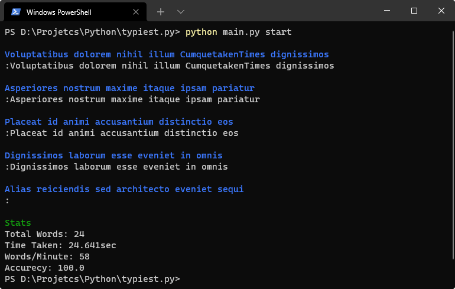

# typiest.py 👨🏻‍💻
Simple console based program for typing speed test made with Python.

## Screenshot

## Usage
To start a test use `python main.py start` and to stop the test leave the field empty and press return.
For more details use `python main.py help`

## Using custom phrases
By default program will use `phrases.txt` file which contains 100 lorem ipsum phrases, to add your custom text just change the contents of `phrases.txt` file to your text.
Make sure each phrases are in new line and it would be better if they do not contains any symbols.
